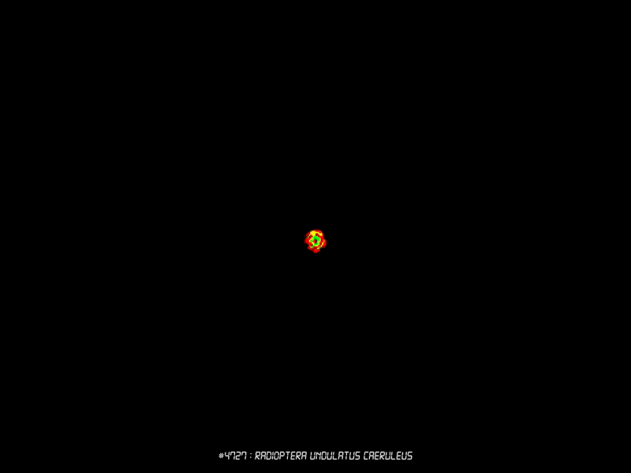

<p align="center">
  
</p>
# Lenia Live Wallpaper

A native Windows live wallpaper that runs [Lenia](https://en.wikipedia.org/wiki/Lenia)
(3-channel, multi-kernel continuous cellular automata) as a GPU shader behind your
desktop icons.

Species parameters come from the catalog of **8,666** parameter sets archived from
[evolvecode.io/alife/lenia](https://evolvecode.io/alife/lenia.html)
(474 named + 8,192 auto-discovered). The simulation and visualization shaders are a
port of the WebGL code from that page — the interactive Lenia demo behind Emergent
Garden’s video *[Artificial Life](https://www.youtube.com/watch?v=2g-CrQfYNtE)*.

<p align="center">
  
</p>

## Features

- Attaches to the desktop WorkerW on **every monitor** (icons stay on top). Each
  monitor runs an independent sim and picks its own random species.
- **24 fps** by default; sim grid = monitor size / 4, nearest-neighbor upscaled with a
  circular vignette (microscope-style falloff). Channels are drawn as literal R/G/B.
- Auto-rotates when a grid dies, saturates, or freezes. Species-name overlay on each
  monitor (baked once per species, cheap to keep on screen).
- **Pauses (zero GPU work)** on battery, fullscreen apps, covered desktops, lock
  screen, or display off.
- Power-friendly: precomputed kernel taps, low-power GPU preference on hybrid laptops,
  coalescable waitable timer, RGBA16F state textures.

## Build

Requires Visual Studio 2022 (C++ workload). No other dependencies.

```
build.cmd
```

Produces `build\LeniaWallpaper.exe`. A `CMakeLists.txt` is also provided.

## Species catalog

The catalog is committed under `catalog/`. To re-download from the source site:

```
python tools\fetch_catalog.py
```

## Run

Start `build\LeniaWallpaper.exe`. The app looks for the catalog next to the exe,
then one directory up (so running from `build\` in this repo works).

Tray menu: species name(s), **Next species**, **Re-seed**, **Random soup**,
**Pause/Resume**, **Run at startup**, **Exit** (restores your static wallpaper).

## Configuration — `config.json` (next to the exe)

| Key | Default | Meaning |
|---|---|---|
| `fps` | `24` | Render/sim rate (1–60). |
| `cellScale` | `4` | Screen pixels per sim cell. |
| `rotateOnResumeSeconds` | `15` | Away longer than this → new species on return. |
| `deathCheckSeconds` | `2` | Dead/frozen-grid probe cadence. |
| `deathGraceSeconds` | `4` | Delay before rotating a dead grid. |
| `pauseOnBattery` | `true` | Pause on DC power. |
| `occludeCoverage` | `0.9` | Foreground coverage that pauses a monitor. |
| `maxKernelRadius` | `25` | Skip species with larger kernels (cost ~R²). |
| `catalogDir` | `"catalog"` | Catalog path relative to the exe. |
| `species` | `""` | Pin one species, e.g. `"named/fission.json"`. |
| `disableAutoPause` | `false` | Ignore automatic pause signals. |

## Layout

- `src/` — Win32 + D3D11 app
- `catalog/` — archived species JSON + `index.json`
- `tools/fetch_catalog.py` — catalog scraper
- `fonts/` — Digital-7 Italic (species name overlay)
- `assets/` — icon and sample renders

## Credits

- **Lenia** — Bert Wang-Chak Chan
- **Species catalog & WebGL reference** — [evolvecode.io/alife/lenia](https://evolvecode.io/alife/lenia.html),
  featured in Emergent Garden’s *[Artificial Life](https://www.youtube.com/watch?v=2g-CrQfYNtE)* video
- **Digital-7** font — Sizenko Alexander / [Style-7](http://www.styleseven.com/) (freeware; see `fonts/README.txt`)

## License

MIT — see [LICENSE](LICENSE). The species catalog is archived from evolvecode.io for
use with this wallpaper; please respect the original site’s terms if you redistribute
or republish those parameter sets separately.
